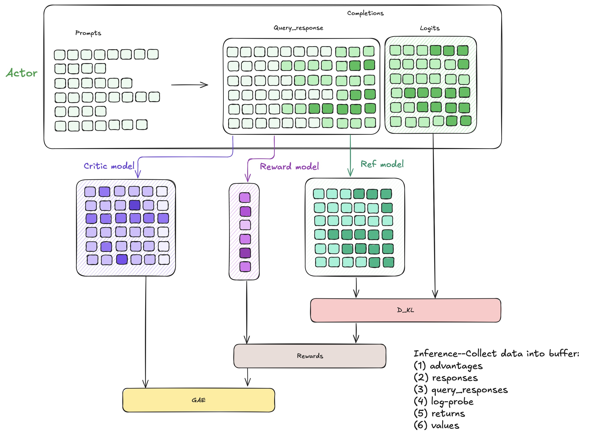
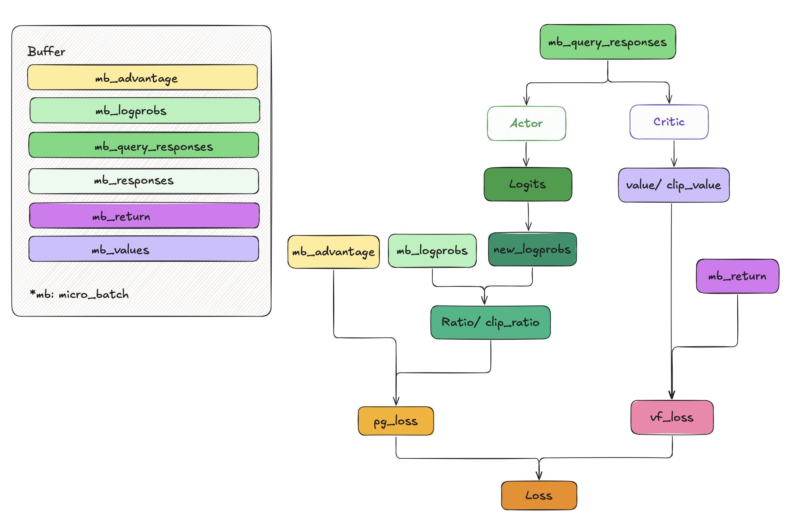
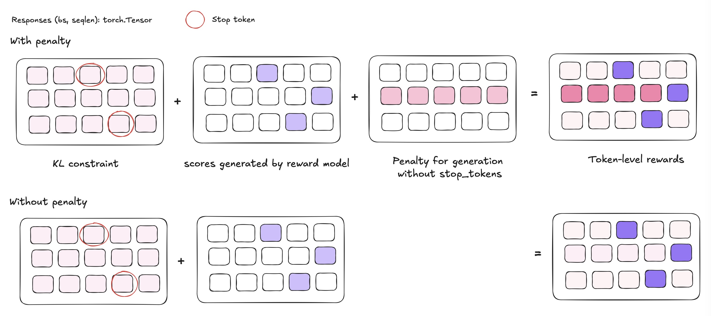
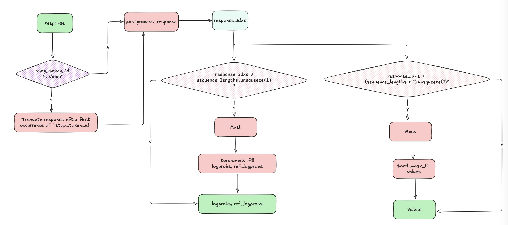
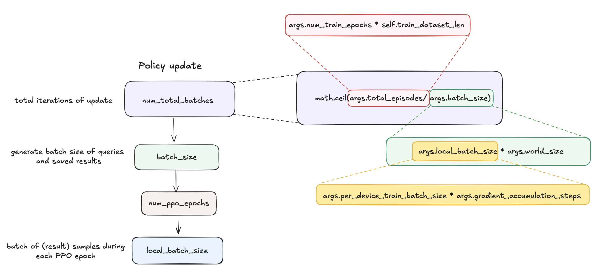

## Introduction

The **Proximal Policy Optimization (PPO)** algorithm, proposed by OpenAI in 2017 [[1]](#references), establishes a robust policy gradient framework that combines three core components: clipped objective functions, value estimation, and entropy regularization.

---

### Objective Function
The unified optimization objective integrates three key elements:  
    
$$L_t^{\text{CLIP+VF+S}}(\theta) = \mathbb{E}_t \left[ L_t^{\text{CLIP}}(\theta) - c_1 L_t^{\text{VF}}(\theta) + c_2 S[\pi_\theta](s_t) \right]$$

#### 1. Clipped Surrogate Objective  
  
$$L_t^{\text{CLIP}}(\theta) = \mathbb{E}_t \left[ \min\left( r_t(\theta) \hat{A}_t,\ \text{clip}\left( r_t(\theta),\ 1-\epsilon,\ 1+\epsilon \right) \hat{A}_t \right) \right]$$  
  
where $r_t(\theta) = \frac{\pi_{\theta}(a_t \mid s_t)}{\pi_{\text{old}}(a_t \mid s_t)}$ is ratio paremeter, $\hat{A}_t$ is advantage estimate and $\epsilon \in [0.1, 0.3]$ a clipping threshold which contrains policy update in a safe limit.
  

#### 2. Value Function Loss  
  
$$L_t^{\text{VF}}(\theta) = \frac{1}{2} \mathbb{E}_t \left[ \left( V_\theta(s_t) - V_t^{\text{targ}} \right)^2 \right]$$  
  
*Implementation Note*: The $\frac{1}{2}$ coefficient serves as a gradient scaling factor.  
  

#### 3. Entropy Regularization  
  
$$S[\pi_\theta](s_t) = -\sum_{a'} \pi_\theta(a'|s_t) \log \pi_\theta(a'|s_t)$$  
  
**Tips**:  
  Coefficients $c_1$ and $c_2$ balance the policy update, value function accuracy, and entropy bonus. Usually value loss weight is set to $c_1 \in [0.5, 1.0]$ and entropy bonus weight is $c_2 \in [0.01, 0.05]$.

---

### Architecture & Execution Pipeline  
  
#### Network Architecture Components
The policy network $\pi_\theta(a|s_t)$ and value function estimator $V_\theta(s_t)$ share a unified neural architecture with sepecialized components such as feature encoder
$h_t=f_\theta^{encoder}(s_t)$ with separate heads, e.g. policy head with $\pi_\theta(a|s_t)={\rm softmax}(W_\pi h_t+b_\pi)$ and output probability distribution over action $\mathcal{A}$ while value head maybe $V_\theta(s_t)=W_vh_t+b_v$ with a scalar value estimate.
  
---

### Execution Workflow

#### Phase 1: Experience Collection Pipeline  
During the rollout phase, agents interact with the environment using the old policy $\pi_{\text{old}}$ to generate trajectories $$\tau=\{(s_t, a_t, r_t)\}_{t=0}^{T-1}$$. Subsequently, the Generalized Advantage Estimation (GAE) method computes advantage values $\hat{A}_t$ through recursive temporal difference calculations:

$$
\begin{aligned}
\delta_t &= r_t + \gamma V_\theta(s_{t+1}) - V_\theta(s_t), \\
\hat{A}_t &= \sum_{\ell=0}^{T-t-1} (\gamma\lambda)^\ell \delta_{t+\ell},
\end{aligned}
$$

where $\gamma$ is the discount factor and $\lambda$ the GAE smoothing coefficient. Processed transitions $$(s_t, a_t, \hat{A}_t, V_t^{\mathrm{targ}})$$ — with target values $$V_t^{\mathrm{targ}}=\hat{A}_t+V_\theta(s_t)$$ — are stored in an experience replay buffer (capacity: $10^5 \sim 10^6$). This staged pipeline decouples data collection from policy updates while maintaining sample diversity through large-scale experience reuse.


#### Phase 2: Parameter Update
For $K$ optimization epochs:
1. *Mini-batch Sampling*: Uniformly sample $B$ transitions ($B \in [64, 2048]$) from buffer.

2. *Policy Optimization*: Compute gradients for the clipped surrogate objective:
$$\nabla_\theta L^{CLIP}=\mathbb{E}_t\left[\min\left(r_t(\theta)\hat{A}_t, {\text clip}(r_t(\theta), 1-\epsilon, 1+\epsilon)\hat{A}_t\right)\nabla_\theta\log\pi_\theta(a_t|s_t)\right]$$

3. *Value Network Update*: Minimize the value function's MSE loss through SGD:
$$\nabla_\theta L^{VF}=\mathbb{E}_{(s_t, V_t^{\text targ})\sim {\text buffer}}\left[(V_\theta(s_t)-V_t^{\text targ}\nabla_\theta V_\theta(s_t))\right]$$

4. *Entropy Adaptation* (Optional): Dynamically adjust $c_2$ based on entropy monitoring.

---  
  
## Applications 

This part will show some applications with PPO including Reinforcement Learning from
Human Feedback (RLHF)[[2]](#references) as well as Atari games.  
  
---  

### RLHF  
RLHF is introduced to further align an LLM to human values. In this part, I attempt to show the details of implementation of RLHF with PPO, including:  
  
- The data workflow of RLHF  
- The mainstream framework 
- Examples  
  
#### The data workflow of RLHF  
  
PPO-based RLHF system typically consists of 4 LLMs: an actor, a critic, a reference policy network and a reward model. PPO-based RLHF proceeds in iterations, each with 3 stages:  
  
- response generation using the actor model with a batch of prompts
- preparation of training data by scoring the generated response through a single forward pass of the critic, reference policy and rewards models
- learning from human preference by updating actor and critic through and backward computation.
  
  
  
After inference, we have collected some data which will be stored into buffer:  
- logprob (from actor)
- ref_logprob (from reference model)
- rewards (token-level rewards, consists of **kl** (*logprobs - ref_logprobs*) and **scores** generated by reward model) 
- values (from critic) 
- token-level advantages  
  
During training, we sample data from buffer and update actor and critic by PPO methods.  
  
  
  
#### The mainstream framwork  
  
**1. TRL**  

From my perspective, TRL [[3]](#references) is a comprehensive and user-friendly library to post-train foundation models. There exists many advanced techniques like Supervised Fine-Tuning (SFT), Proximal Policy Optimization (PPO) and Group Relative Policy Optimization (GRPO) and so on.  

For initial implementation, I strongly recommend reading the [Official PPO Trainer Documentation](https://huggingface.co/docs/trl/main/en/ppo_trainer).  
  
Here, I aim to highlight the core computation codes, which will help you gain a deeper understanding of PPO in the RLHF (Reinforcement Learning from Human Feedback) scenario. For comprehensive implementation details, refer to the canonical guide:  The N Implementation Details of RLHF with PPO [[4]](#references).  
    
1. **How to get scores?**  
   We feed query as well as response into reward model to attain scores. This means that each score of a token is highly dependent on previous tokens.  
2. **How to compute rewards?**  
   Through reward model, we attain scores which is only given at the end of episode (stop_token) with shape `(batch_size, 1)`. But it is not the final reward. Actually, The complete reward function combines supervised signal, policy constraint ([trl/trl/trainer
/ppo_trainer.py#509](https://github.com/huggingface/trl/blob/64aa06499b2e71537a8e701fad076873b0f3603f/trl/trainer/ppo_trainer.py#L509-L515)) and sometimes penalty to responses which don't have stop_token:  
     
    $$ \mathcal{R}(x,y) = \underbrace{r_\theta(x,y)}_{\text{Reward Model}} - \beta \cdot \underbrace{D_{\text{KL}}\big(\pi_\phi(y|x) \parallel \pi_{\text{ref}}(y|x)\big)}_{\text{Policy Regularization}}$$

    


3. **Scale the logits by sampling temperature**  
   When calculating the log probability of responses, the model first outputs the logits of the tokens in reponses, followed by dividing the logits with the sampling temperature ([lm_human_preferences/policy.py#L121](https://github.com/openai/lm-human-preferences/blob/cbfd210bb8b08f6bc5c26878c10984b90f516c66/lm_human_preferences/policy.py#L121)) i.e.,  
   ```python
   logits /= self.temperature
   ```
   It is said that without this scaling, the KL would rise faster than expected, and performanc would deteriorate[[4]](#references).  

4. **Carefully mask scores and logprobs**. TRL create attention mask by 3 process  
   - Truncate responses containing `stop_token_id`.  
   - Create index of responses.
   - Create mask by comparing index and responses' length.
   - Mask `logprob`, `ref_model` as well as `values`.  

     
    
* Be careful with padding `values` [[6]](#references)  

5. [Pytorch Adam optimizer numerical issues w.r.t RLHF](https://huggingface.co/blog/the_n_implementation_details_of_rlhf_with_ppo#pytorch-adam-optimizer-numerical-issues-wrt-rlhf).  
   
6. **During PPO training with `num_total_batches` update rounds, how are `batch_size`, `local_batch_size` and `num_ppo_epochs` involved?**  
   
     

   TRL implemented PPO algorithm samples and trains for `num_total_batches` rounds.  
   In each rounds:  

      - It samples `local_batch_size * word_size` data from the environment (i.e., `batch_size`).
      - It then trains this batch `num_ppo_epochs` times, typically with minibatches of `local_batch_size` on each device.


---

## References
1. Schulman, J., Wolski, F., Dhariwal, P., Radford, A., & Klimov, O. (2017). Proximal Policy Optimization Algorithms. *arXiv preprint arXiv:1707.06347*.  
   DOI: [10.48550/arXiv.1707.06347](https://doi.org/10.48550/arXiv.1707.06347)  
2. Yuntao Bai, Andy Jones, Kamal Ndousse, Amanda Askell, Anna Chen, Nova DasSarma, Dawn Drain, Stanislav Fort, Deep Ganguli, Tom Henighan, et al. 2022. Training a helpful and harmless assistant with reinforcement learning from human feedback. arXiv preprint *arXiv:2204.05862 (2022)*.
3. [https://github.com/huggingface/trl](https://github.com/huggingface/trl)
4. [The N Implementation Details of RLHF with PPO](https://huggingface.co/blog/the_n_implementation_details_of_rlhf_with_ppo)
5. Diederik K. Adam: A method for stochastic optimization[J]. (No Title), 2014.
6. [https://excalidraw.com/#json=LWnzG4w2k5DjF_EOL_xPt,e2w3a-hFJ_gX5vOfeyXGTw](https://excalidraw.com/#json=LWnzG4w2k5DjF_EOL_xPt,e2w3a-hFJ_gX5vOfeyXGTw)